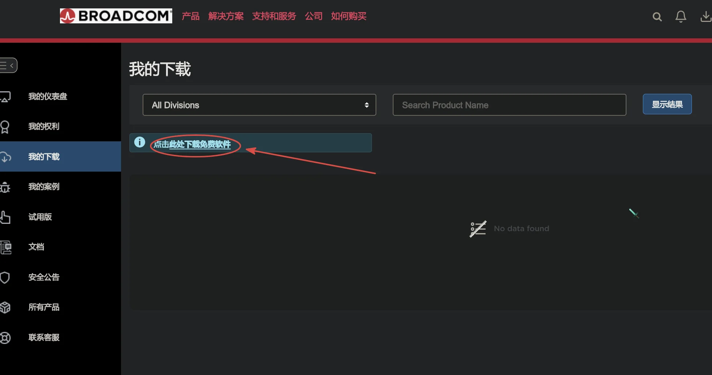
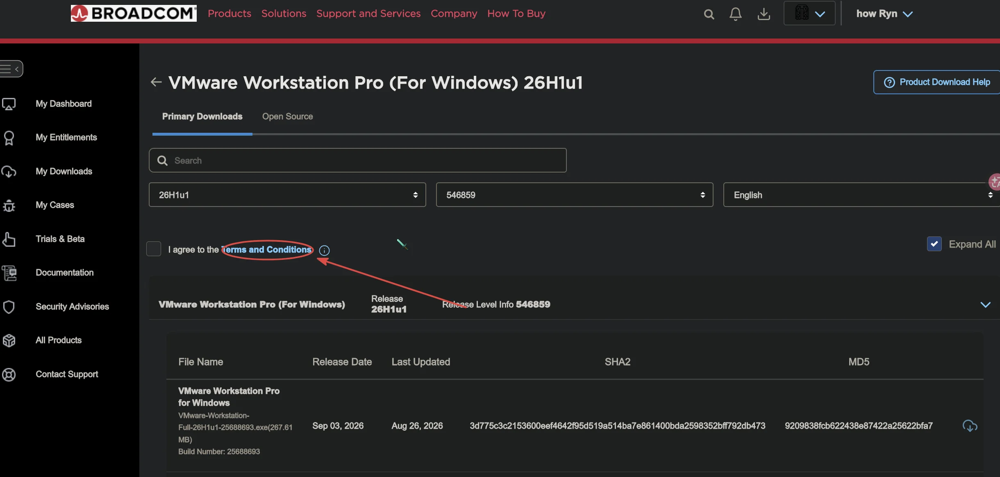

---

title: VMware的使用问题
published: 2026-09-11
category: VMware
tags: [VMware]
image: ./images/VMware.webp

---


对于**Pro版本**（包括Workstation Pro和Fusion Pro），免费是一个逐步推进的过程：

- **个人免费**：自 **2024年5月14日**（版本17.5.2）起，Workstation Pro和Fusion Pro开始对**个人用户**免费。
- **全面免费**：自 **2024年11月11日**（版本17.6.2）起，免费范围扩大至**所有用户**，包括商业、教育和个人用途，且无需许可证密钥。同时，原有的Player版本宣布停产。


------

<div style="height: 2em;"></div>

## 关于下载

看到很多同学找不到下载链接，下载链接为[VMware](https://www.vmware.com/products/desktop-hypervisor/workstation-and-fusion)

点击下载后需要注册账户，最好是Gmail或者outlook，实测163和qq邮箱不能接收验证码





之后向下滑动就能找到，选择需要的版本就可以下载，进入后需要点击这个





点击一下关掉就行，这时候就可以勾选然后下载了


------

<div style="height: 2em;"></div>

## 关于无权限的问题

这个需要自己打命令，他不像windows那样直观，需要自己去提权

```bash
sudo su
```


------

<div style="height: 2em;"></div>

## 主机和虚拟机复制粘贴不互通

这个情况是因为没有安装vm-tools-desktop这个工具

```bash
sudo apt update
sudo apt install open-vm-tools open-vm-tools-desktop
```

安装完成后需要重启才能用


------

