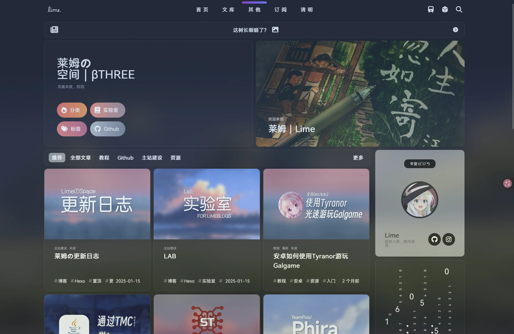

以下都是个人观点，有不同看法就按你的来。主题这东西本来就是萝卜白菜各有所爱。

---

## Astro 主题

### AstroPaper

Astro 官方推荐的主题，性能是它最大的卖点，跑起来很流畅。响应式布局做得不错，不用特意写移动端适配。

对我来说太简约了。没有 TOC，这个我比较在意。也不支持一键汉化，想汉化只能改组件。

官方链接：https://github.com/satnaing/astro-paper

### Firefly

基于 fuwari 模板二次开发的主题，也就是本站现在用的这个。

组件给得比较全，自带 TOC 和音乐播放器。i18n 支持得不错，改改语言文件就能切换。页面过渡动画做得比较平滑。

暂时没发现什么明显的缺点。

官方链接：https://github.com/CuteLeaf/Firefly

### Mizuki

同样是基于 fuwari 的二改主题，但和 Firefly 的侧重点不太一样。

自带多种字体，组件比 Firefly 还多，日记、相册这些都有。我平时用不到那么多，如果喜欢折腾组件可以试试。

组件多也意味着更重，加载速度会比 Firefly 慢一些。

官方链接：https://github.com/LyraVoid/Mizuki

---

## Hexo 主题

### Butterfly

Hexo 生态里最主流、最活跃的主题，GitHub 星标 8000+，社区支持完善。

功能覆盖得很全，暗色模式、多语言、评论系统、站内搜索都有，基本你能想到的博客功能它都自带。中文文档和社区都比较活跃，遇到问题好搜到答案。支持通过 npm 装插件扩展功能。

功能多也带来了配置复杂，新手需要花点时间学习。主题体积偏大，默认配置下加载速度一般，想快得自己手动优化。部分高级定制需要改 Stylus/CSS 源码，对不懂前端的用户不太友好。

适合那种希望一站式解决所有博客需求、愿意花时间配置、准备长期维护的作者。

官方链接：https://github.com/jerryc127/hexo-theme-butterfly

### Next

Hexo 里的经典老主题，迭代了很多年，稳定性和兼容性都很好。

和 Hexo 各版本兼容性都不错，不太会遇到兼容问题。配置简单，新手容易上手。支持单栏/双栏布局，评论系统也支持多种。SEO 默认配置就比较友好。

设计风格偏传统，视觉上没有现代主题那么有冲击力。功能更新比较慢，部分新特性比如暗色模式需要手动配。定制化程度不如 Butterfly。

适合追求稳定、不喜欢频繁折腾、主要写技术文章的人。

官方链接：https://github.com/next-theme/hexo-theme-next

### Lime

某位大佬深度魔改 Solitude 出来的主题，偶然刷到的。我还没实际用过，就不多评价了，效果看下图。

大佬链接：https://github.com/LimeBlogs/Lime-Hexo

大佬的博客：https://sudachi.top/